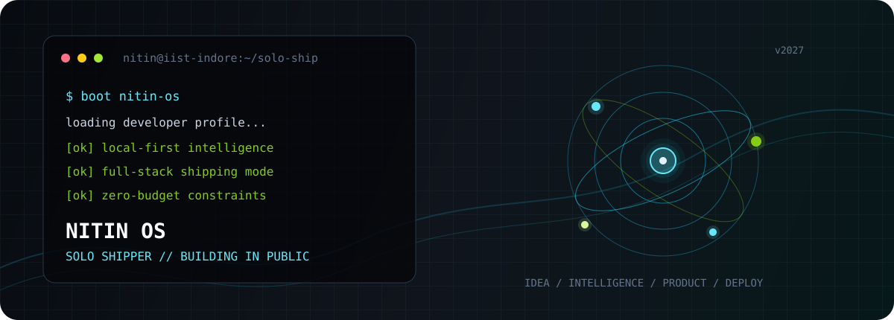

<div align="center">



<br/><br/>


<br/>

<p>
  <a href="https://github.com/nitinsingh2006"><b>GitHub</b></a> &nbsp;&nbsp;·&nbsp;&nbsp;
  <a href="https://www.linkedin.com/in/nitin-singh-657089339" target="_blank"><b>LinkedIn</b></a> &nbsp;&nbsp;·&nbsp;&nbsp;
  <a href="https://www.npmjs.com/~nitinsingh2006" target="_blank"><b>npm</b></a> &nbsp;&nbsp;·&nbsp;&nbsp;
  <a href="mailto:nsingh987610@gmail.com"><b>Email</b></a>
</p>

</div>

---

## `boot sequence`

```text
$ whoami

nitin@iist-indore
-----------------
role        solo product developer
mode        vibe coder & systems builder
specialty   local-first AI & full-stack products
strategy    zero-budget-first architecture
default     local models on-device (Ollama / Rust)
shipping    end-to-end

$ ./start-building

[01] find a real friction point
[02] keep infrastructure lean and cost at zero
[03] move intelligence directly to user hardware
[04] ship the complete loop
```

I am **Nitin Singh**, a B.Tech CSE student ('28) at IIST Indore building software independently.

My stack is chosen for speed, autonomy, and zero recurring overhead:

```text
idea -> interface -> intelligence -> data -> payments -> deployment
```

No waiting for large teams, no enterprise bloat, and no monthly cloud infrastructure bills.

---

## `operating principles`

| Principle | Practical Execution |
|:---|:---|
| **`zero-budget-first`** | Start with architectures that never depend on paid infrastructure to launch or scale. |
| **`local-first AI`** | Prefer on-device models and local execution when privacy, latency, and cost matter. |
| **`solo end-to-end`** | Own the full path: data modeling, native IPC, UI/UX, testing, and production deployment. |
| **`ship the loop`** | A feature is incomplete until it forms an automated, repeatable, usable workflow. |
| **`built for Bharat 🇮🇳`** | Design around Indian business realities: GST compliance, Razorpay rails, and local workflows. |

---

## `featured products`

### 01. [Nitin-AI](https://github.com/nitinsingh2006/Nitin-AI) — Open-Source Local AI Workstation
> A native desktop AI workstation designed around local model execution, sandboxed agent workflows, and private data.
- **Architecture**: `Rust` · `Tauri` · `SQLite` · `Ollama` · `React` · `npm package`
- **Signal**: Native IPC bridge, zero cloud latency, embedded local database, and package distribution via npm.

### 02. [CodeQuest AI](https://codequest-ai-one.vercel.app/) — Gamified Coding Platform
> A gamified coding platform where practice, execution, progress, and AI mentorship happen inside one feedback loop.
- **Architecture**: `Next.js` · `Pyodide (WASM)` · `Ollama` · `Docker`
- **Signal**: Client-side Python code execution via WebAssembly, quest leaderboards, and zero server execution cost.

### 03. [Invo](https://github.com/nitinsingh2006/invo) — Invoicing for Indian Freelancers
> AI-assisted financial operations focused on the operational reality of independent Indian professionals.
- **Architecture**: `Next.js` · `Prisma` · `Razorpay` · `Gemini API` · `Clerk`
- **Signal**: GST-compliant invoice generation, Razorpay automated payment links, and Gemini-powered payment reminders.

### 04. [ResumeForge](https://github.com/nitinsingh2006/resume-forge) — Structured Career Documents
> ATS-friendly resume builder that treats career history as structured schema first, visual document second.
- **Architecture**: `Next.js` · `Prisma` · `Docker` · `Playwright`
- **Signal**: Multi-format export (PDF, DOCX, JSON), containerized workflows, and automated end-to-end tests.

### 05. [PortfolioSathi](https://github.com/nitinsingh2006/portfoliosathi) — Developer Identity Engine
> Converts developer signals from GitHub accounts and LinkedIn PDFs into an interactive 3D web experience.
- **Architecture**: `Next.js` · `Three.js` · `GitHub API` · `pdf-parse`
- **Signal**: Automatic PDF signal extraction, animated WebGL canvas, and zero manual form filling.

### 06. [Lead Gen Automation](https://github.com/nitinsingh2006/lead-gen-automation) — Autonomous Prospecting Pipeline
> A Python automation pipeline connecting business discovery, AI demo generation, deployment, and outreach.
- **Architecture**: `Python` · `Apify` · `Gemini API` · `GitHub Pages`
- **Signal**: Automated lead discovery, synthetic site generation with Gemini, and one-click GitHub Pages deployment.

<details>
<summary><strong>🔍 View secondary tools and experimental utilities</strong></summary>
<br/>

- **[GitHub Roaster](https://github.com/nitinsingh2006/github-roaster)**: Transforms GitHub profile metrics into multilingual AI roasts using ultra-low latency Groq inference (`Next.js` · `GitHub API` · `Groq`).
- **[nitin-free-claude-code](https://github.com/nitinsingh2006/nitin-free-claude-code)**: High-throughput FastAPI proxy router for Claude Code and Codex tooling with intelligent failover (`Python` · `FastAPI`).
</details>

---

## `capability map`

```text
LANGUAGES       TypeScript  JavaScript  Python  Rust  C++  SQL
FRONTEND        Next.js  React  TailwindCSS  Three.js  Framer Motion
BACKEND & DATA  Prisma ORM  PostgreSQL  SQLite  Clerk Auth  Razorpay
AI & RUNTIMES   Ollama (Local LLMs)  Gemini API  Groq LPU  Pyodide (WASM)  Agents
DEVOPS & QA     Docker  GitHub Actions CI/CD  Vercel  Playwright E2E  Linux
```

```text
Rust / Tauri    -> when the product needs native desktop performance with zero cloud bills
Ollama          -> when intelligence should stay private, offline, and close to the user
SQLite          -> when a product should start immediately without external database servers
PostgreSQL      -> when relational schema complexity needs room to grow
Pyodide (WASM)  -> when untrusted code execution belongs in the client browser
Playwright      -> when confidence and quality must be verified before shipping
```

---

## `live telemetry`

<div align="center">


<br/><br/>

<picture>
  <source media="(prefers-color-scheme: dark)" srcset="https://raw.githubusercontent.com/nitinsingh2006/nitinsingh2006/output/github-contribution-grid-snake-dark.svg">
  <source media="(prefers-color-scheme: light)" srcset="https://raw.githubusercontent.com/nitinsingh2006/nitinsingh2006/output/github-contribution-grid-snake.svg">
  
</picture>

</div>

---

## `contact`

If you are building something practical with local AI, developer tools, or automation:

- **GitHub**: [@nitinsingh2006](https://github.com/nitinsingh2006)
- **LinkedIn**: [Nitin Singh](https://www.linkedin.com/in/nitin-singh-657089339)
- **npm**: [~nitinsingh2006](https://www.npmjs.com/~nitinsingh2006)
- **Email**: [nsingh987610@gmail.com](mailto:nsingh987610@gmail.com)

<br/>

<div align="center">

```text
built independently from Indore, India 🇮🇳
```

</div>
