<!-- ═══════════════════════════════════════════════════════════════════════════
     NITIN SINGH — GitHub Profile README
     Designed as a hiring asset for AI Engineering / GenAI internships.
     Hand-crafted SVG banners, dark/light mode aware, recruiter-optimized.
     ═══════════════════════════════════════════════════════════════════════════ -->

<!-- Hand-crafted SVG banner — dark/light mode adaptive via <picture> -->
<picture>
  <source media="(prefers-color-scheme: dark)" srcset="./assets/banner-dark.svg">
  <source media="(prefers-color-scheme: light)" srcset="./assets/banner-light.svg">
  
</picture>

 

  &nbsp;
  &nbsp;
  

---

**Second-year B.Tech CSE student who builds production AI infrastructure — not wrappers, not demos.**

I architect local-first AI systems in Rust where secrets stay in the OS keychain and models run on-device. I ship full-stack products in TypeScript and orchestrate multi-provider LLM pipelines across Ollama, OpenAI, Anthropic, Gemini, and OpenRouter. Six products shipped solo end to end — from system architecture to deployment. Published on npm. Three professional certifications (OCI DevOps, OCI Developer, CEH).

**🎯 Currently seeking:** a remote, part-time **AI Engineering / Generative AI internship** where I can contribute to production AI systems.

---

## ⚡ Flagship: Nitin-AI

> **Open-source, local-first AI workstation** — your models, your data, your machine.

Most AI tools lock you into cloud APIs and send your data to third-party servers. Nitin-AI is built on a different premise: a **Rust/Tauri trusted core** that keeps secrets in the OS keychain, persists everything to local SQLite, and gives you a **provider registry** that hot-swaps between Ollama, OpenAI, Anthropic, Gemini, and OpenRouter — simultaneously. A sandboxed agent runtime handles autonomous task execution with safety boundaries, all behind a fast React desktop UI.

**Why this matters:** Provider independence is the biggest operational risk in AI engineering today. Nitin-AI solves it at the infrastructure layer.

| Layer | What it does | Tech |
|:--|:--|:--|
| **Trusted Core** | OS-level secret management, native process control, memory safety | Rust, Tauri |
| **Persistence** | Conversations, config, provider state — all local, no cloud dependency | SQLite |
| **Provider Registry** | Hot-swap between 5+ local/cloud model providers via unified API | Ollama, OpenAI, Anthropic, Gemini, OpenRouter |
| **Agent Runtime** | Autonomous task execution with safety boundaries and sandboxing | Sandboxed environment |
| **Desktop UI** | Real-time streaming, multi-conversation management | React |

  &nbsp;
  &nbsp;
  

---

## 🚀 What I've Shipped

### [CodeQuest AI](https://codequest-ai-one.vercel.app) &nbsp; 

**Zero-cost, zero-risk coding education.** Gamified platform with quests, leaderboard, and **in-browser Python execution via Pyodide** — no server-side code execution means no infrastructure cost and no security surface. A local Ollama mentor provides AI tutoring without ever hitting a cloud API.

> _Technical selling point:_ Server-side code execution is the #1 cost and security problem in edtech platforms. CodeQuest eliminates both by running Python entirely in the browser via WebAssembly.

`Next.js` `Prisma` `PostgreSQL` `Ollama` `Pyodide` `Docker`

### [Invo](https://github.com/nitinsingh2006/invo)

**GST-compliant invoicing for Indian freelancers, without enterprise pricing.** AI-assisted invoicing SaaS with Clerk authentication, Razorpay payment links, PDF generation, and Gemini-powered payment reminders that actually chase your clients.

`Next.js` `Prisma` `Clerk` `Razorpay` `Gemini`

### [PortfolioSathi](https://github.com/nitinsingh2006/portfoliosathi)

**Portfolio generation from your existing data.** Feed it a GitHub username and a LinkedIn PDF export — it parses both sources server-side and generates an animated, data-driven portfolio site. No manual data entry beyond what you already have.

`Next.js` `GitHub REST API` `pdf-parse` `Three.js`

### [ResumeForge](https://github.com/nitinsingh2006/resume-forge)

**ATS-optimized resume builder with real testing infrastructure.** Live preview, multiple templates, PDF/DOCX/JSON export — tested with Vitest and Playwright, Dockerized, auth-ready. Built to the standard of production software, not a weekend hack.

`Next.js` `Prisma` `Docker` `Vitest` `Playwright`

### [Lead Gen Automation](https://github.com/nitinsingh2006/lead-gen-automation)

**Automated outreach pipeline.** Finds local businesses via Apify, generates custom demo websites with Gemini, deploys to GitHub Pages, and runs email outreach — fully automated, end to end.

`Python` `Apify` `Gemini` `GitHub Pages` `SMTP`

<b>More projects →</b>

 

**[nitin-free-claude-code](https://github.com/nitinsingh2006/nitin-free-claude-code)** — Python/FastAPI proxy tooling for Claude Code and Codex with provider routing and admin UI

**[GitHub Roaster](https://github.com/nitinsingh2006/github-roaster)** — Analyzes GitHub profiles and generates multilingual AI roasts via Groq-compatible chat API

**[nitin-ai (npm)](https://www.npmjs.com/package/nitin-ai)** — Autonomous AI developer agent for terminal workflows, BYO API key

---

## 🧠 Stack

<table>
<tr>
<td valign="top" width="50%">

**AI & LLM Infrastructure** 

  
**Systems & Desktop** 

</td>
<td valign="top" width="50%">

**Full-Stack** 

  
**DevOps & Quality** 

</td>
</tr>
</table>

---

## 🏅 Credentials

<table>
<tr>
<td align="center" width="33%">
 
Oracle Cloud Infrastructure
</td>
<td align="center" width="33%">
 
Oracle Cloud Infrastructure
</td>
<td align="center" width="33%">
 
EC-Council
</td>
</tr>
</table>

🎓 &nbsp;B.Tech CSE — **Indore Institute of Science & Technology** (RGPV University) · Class of 2028
 
🏆 &nbsp;**Smart India Hackathon** (Mini SIH 2025) participant — built with Claude Code + Opus

---

## 📊 GitHub

  
  

 

  <picture>
    <source media="(prefers-color-scheme: dark)" srcset="https://raw.githubusercontent.com/nitinsingh2006/nitinsingh2006/output/github-snake-dark.svg">
    <source media="(prefers-color-scheme: light)" srcset="https://raw.githubusercontent.com/nitinsingh2006/nitinsingh2006/output/github-snake.svg">
    
  </picture>

---

### Let's build something together

I'm looking for a **remote, part-time AI engineering internship** where I can contribute to production AI systems. 
I bring Rust + TypeScript + Python fluency, multi-provider LLM integration experience, 
and the ability to ship end-to-end — solo.

 

&nbsp;

 

