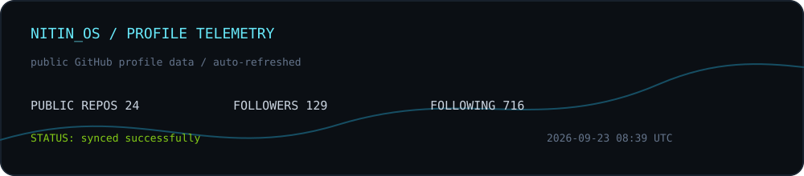

<div align="center">


<br>

# NITIN OS // SOLO SHIPPER

### I build AI-powered products alone, from architecture to deployment.

`B.Tech CSE 2027` · `IIST Indore` · `India`

<br>

<a href="https://github.com/nitinsingh2006">GitHub</a>
&nbsp;&nbsp;·&nbsp;&nbsp;
<a href="https://www.npmjs.com/~nitinsingh2006">npm</a>
&nbsp;&nbsp;·&nbsp;&nbsp;
<a href="https://www.linkedin.com/in/nitinsingh2006/">LinkedIn</a>

</div>

---

## `boot sequence`

```text
$ whoami

nitin@iist-indore
-----------------
role       solo developer
mode       vibe coder
specialty  AI-powered full-stack products
strategy   zero-budget-first
default    local-first AI
shipping   end-to-end

$ ./start-building

[01] find a real problem
[02] keep infrastructure lean
[03] move intelligence closer to the user
[04] ship the complete loop
```

I am **Nitin Singh**, a B.Tech CSE student at IIST Indore building products independently.

My preferred stack is not chosen to look impressive. It is chosen to let one person move from:

```text
idea -> interface -> intelligence -> data -> payments -> deployment
```

without waiting for a large team, a large budget, or a large infrastructure bill.

---

## `the solo ship loop`

```text
                         +----------------------+
                         |      REAL SIGNAL      |
                         | GitHub data, users,   |
                         | business workflows   |
                         +----------+-----------+
                                    |
                                    v
+------------------+       +--------+---------+       +------------------+
| 1. OBSERVE       +------>+ 2. INTELLIGENCE  +------>+ 3. BUILD         |
| profiles, leads, |       | local models,    |       | web, desktop,    |
| documents, code  |       | agents, prompts  |       | APIs, automation  |
+------------------+       +--------+---------+       +--------+---------+
                                    |                         |
                                    v                         v
                         +----------+-----------+   +---------+----------+
                         | 4. LOCAL-FIRST      |   | 5. SHIP            |
                         | useful offline,     |   | deploy, test,      |
                         | cheap by default    |   | monetize, iterate  |
                         +----------------------+   +--------------------+
```

My projects are different interfaces for the same goal:

> Turn an expensive workflow into a product that one developer can actually ship.

---

## `project constellation`

### 01. Local Intelligence

<details open>
<summary><strong>Nitin-AI</strong> — an open-source local-first AI workstation</summary>

```text
core       Rust + Tauri
data       SQLite
models     Ollama
runtime    sandboxed agent runtime
interface  React desktop UI
package    npm package
```

A desktop AI workstation designed around local execution, agent workflows, and user-controlled data.

</details>

<details>
<summary><strong>CodeQuest AI</strong> — coding practice as a game loop</summary>

```text
learning   quests and leaderboard
execution  browser-based code execution with Pyodide
mentor     local Ollama mentor
cost model zero server cost
```

A gamified coding platform where practice, execution, progress, and AI feedback happen inside one loop.

</details>

---

### 02. Product Systems

<details open>
<summary><strong>Invo</strong> — invoicing infrastructure for Indian freelancers</summary>

```text
domain     GST-compliant invoicing
payments   Razorpay payment links
AI layer   Gemini-powered reminders
audience   Indian freelancers
```

An AI-assisted invoicing platform focused on the operational reality of independent Indian professionals.

</details>

<details>
<summary><strong>ResumeForge</strong> — structured career documents</summary>

```text
focus      ATS-friendly resumes
exports    PDF, DOCX, JSON
delivery   Dockerized
quality    tested
```

A resume builder that treats a resume as structured data first and a visual document second.

</details>

---

### 03. Identity And Distribution

<details open>
<summary><strong>PortfolioSathi</strong> — identity from existing professional data</summary>

```text
input      GitHub username + LinkedIn PDF
output     automatically generated animated portfolio
direction  less manual formatting, more signal extraction
```

A portfolio generator that converts existing developer identity into an animated web presence.

</details>

<details>
<summary><strong>GitHub Roaster</strong> — profile data with a multilingual personality layer</summary>

```text
input      GitHub profile data
output     multilingual AI roast
purpose    make developer profiles more memorable
```

A lightweight experiment in turning structured profile data into entertaining, shareable output.

</details>

<details>
<summary><strong>Lead Gen Automation</strong> — a complete prospect-to-deployment pipeline</summary>

```text
discover   find local businesses
generate   create demo websites with Gemini
deploy     publish to GitHub Pages
outreach   automate email communication
runtime    Python pipeline
```

A Python automation pipeline that connects lead discovery, AI-generated demos, deployment, and outreach.

</details>

---

## `capability map`

```text
LANGUAGES
TypeScript  JavaScript  Python  Rust  C  C++  SQL

FRONTEND
Next.js  React  TailwindCSS  Three.js  Framer Motion

BACKEND / DATA
Prisma  PostgreSQL  SQLite  Clerk  Razorpay

AI / AGENTS
Ollama  Gemini  Groq  OpenRouter  Claude Code

DEVOPS / QUALITY
Docker  GitHub Actions  Vercel  Playwright
```

I use different tools for different constraints:

```text
Rust/Tauri       when the product should feel local and native
Ollama           when intelligence should stay close to the user
SQLite           when a product should start without infrastructure
PostgreSQL       when the data model needs room to grow
Pyodide          when code execution should happen in the browser
Docker           when the whole system should be reproducible
Playwright       when shipping is not enough without confidence
```

---

## `operating principles`

| Principle | What it means in practice |
|---|---|
| `zero-budget-first` | Start with architecture that does not depend on expensive infrastructure |
| `local-first AI` | Prefer local models and local execution when privacy and cost matter |
| `solo end-to-end` | Own the path from idea, design, code, testing, and deployment |
| `ship the loop` | A feature is incomplete until it creates a usable workflow |
| `Indian by default` | Build with Indian users, payments, documents, and workflows in mind |

---

## `live telemetry`

<div align="center">



</div>

> This panel is generated automatically from public GitHub profile data.
> No static stats card. No manually edited numbers.

---

## `how I think about products`

```text
A polished interface is not the product.

The product is the complete path:

input
  -> useful transformation
  -> trustworthy output
  -> repeatable workflow
  -> measurable distribution
```

That is why my projects move across different surfaces:

```text
desktop AI          Nitin-AI
coding education    CodeQuest AI
freelancer ops       Invo
developer identity   PortfolioSathi
career tooling       ResumeForge
business growth      Lead Gen Automation
developer fun        GitHub Roaster
```

---

## `contact`

If you are building something practical with AI, local models, developer tools, or automation:

- GitHub: [@nitinsingh2006](https://github.com/nitinsingh2006)
- npm: [~nitinsingh2006](https://www.npmjs.com/~nitinsingh2006)
- LinkedIn: [nitinsingh2006](https://www.linkedin.com/in/nitinsingh2006/)

<br>

<div align="center">

```text
built independently from India
```

</div>
